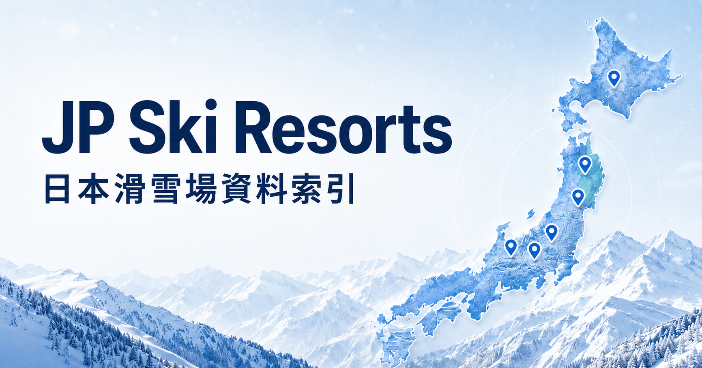

  <strong>繁體中文</strong> | <a href="./README.en.md">English</a>

# 日本滑雪場指南

自從愛上滑雪後，下定決心每年都要至少到日本滑一趟，但每次安排旅程找資料都很煩惱，常常重複的網站一直來回跳，做了一大堆筆記。
就這樣好多年覺得乾脆自己做一個網站，除了自己也用得到也能分享出去，希望能幫助到每個愛滑雪的人！
日本滑雪場指南是一個日本滑雪場資料庫。主要以繁體中文整理日本各地滑雪場、雪場區域、縣別特色、雪道資訊與官方資料入口。

## 🏂 可以怎麼用

- 想找下一趟滑雪旅行的候選雪場。
- 想比較同一區域有哪些雪場可以安排在同一趟。
- 想快速看雪場特色、適合族群、雪道感覺與官方資訊。
- 想用縣別、地區、標籤或關鍵字縮小範圍。
- 想找雪道影片，先看看實際滑起來的感覺。

## 🗺️ 頁面內容

| 頁面 | 內容 |
| --- | --- |
| 首頁 | 以日本滑雪地區為入口，提供列表與地圖式瀏覽，快速認識各地雪場分布。 |
| 滑雪場列表 | 集中列出已整理的雪場，可用關鍵字、縣別與標籤篩選。 |
| 滑雪場詳細頁 | 整理雪場特色、基本資訊、營業時段、票券、交通方式、雪道概況與其他參考內容。 |
| 雪道資訊頁 | 依難度整理雪道，包含長度、坡度、備註與可參考的實滑影片。 |
| 地區頁 | 依北海道、東北、關東甲信越等大地區整理雪場，適合先抓旅行方向。 |
| 縣別總覽 | 依都道府縣建立入口，快速找到每個縣收錄的雪場。 |
| 縣別頁 | 補充各縣滑雪特色與同縣雪場清單，適合做區域比較。 |
| 雪場區域總覽 | 整理像湯澤、白馬、妙高這類滑雪旅行常用區域。 |
| 雪場區域頁 | 說明區域特色、交通樞紐感、周邊雪場關係與代表雪場。 |

## ✨ 主要功能

- 關鍵字搜尋：用中文、英文或雪場名稱片段快速找資料。
- 篩選工具：依縣別與標籤縮小清單，適合從需求反推雪場。
- 地區瀏覽：從日本大區域切入，先看哪一帶比較符合行程。
- 縣別瀏覽：以都道府縣整理雪場與滑雪特色。
- 雪場區域瀏覽：用實際排行程時常用的滑雪區域來比較。
- 雪道影片整理：把可對應雪道的影片放在雪道資料裡，方便先看路線感。

## ❄️ 關於雪況與天氣

目前網站先以穩定的雪場資料、區域介紹與雪道整理為主。等到未來雪季開始後，會再把雪況與天氣資訊加入，讓出發前的確認更方便。

## 📚 資料來源

本專案以官方與公開資料為主要參考來源，並整理成適合台灣滑雪者閱讀的版本。

- [日本觀光局 Travel Japan](https://www.japan.travel/tw/)
- [Weathernews Ski & Snow](https://weathernews.jp/s/ski/)
- 各滑雪場官方網站、官方雪道圖、票價頁、營業資訊頁與交通資訊頁。
- 公開的滑雪影片與旅遊文章，作為雪道感、區域特色與行程安排的輔助參考。

## 🙌 特別感謝

- [大林滑雪男子](https://www.youtube.com/@drlinsnow)
- [娜塔蝦的滑雪食旅手記](https://natasha-traveler.tw/)
- [Real Japan Nature](https://www.youtube.com/@realjapannature)

## 🔒 專案所有權與授權

本專案不採用 MIT 或其他開源授權。

本專案公開於 GitHub，僅供作品展示與參考。未經作者明確授權，不得複製、修改、散布、再授權、商業使用，或將本專案內容宣稱為自己的作品。

詳細條款請見 [LICENSE](LICENSE)。
